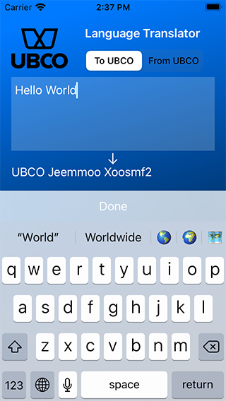

# UBCO Translator
### Demo app language translator

This is a fun little swift demo exercise with a simple interface to "translate" text from your native language to alien "UBCO" language.
I set the minimum iOS platform to iOS15 so I could use the latest SwiftUI features, a real-world app would have to consider the userbase (e.g: if you have iPhone 6 users then you need to target iOS12).

##### UBCO Translation Rules from spec:
1. Text always begins with the word ‘UBCO’.
2. All vowels in the original text (a, e, i, o, u) are doubled.
3. All other letters (the consonants) in the original text are shifted by one place to
the next consonant in the alphabet. For example:
    * ‘b' goes to 'c’ 
    * ‘d' goes to 'f’ 
    * ‘z' goes to 'b’
4. Text ends with a number indicating the number of words in the original text.
5. Case is preserved.
6. All other characters (punctuation, whitespace, etc) are unchanged.

#### Running the app
- I can invite anyone on iOS15+ to try the app through Apple's TestFlight app
- Or download the project on GitHub, open **UBCO_Translator.xcodeproj** in XCode and run it on simulator or a real device plugged into a Mac

#### Bonus feature
- Being able to translate text in only one direction seemed problematic, so I added a toggle control to allow the translation to work in reverse

#### Specification Assumptions
- This seems like an old-school ASCII function, but we live in a world with complex unicode text
- I made sure the app was unicode safe.  Feel free to put in emojis or chinese characters
- The spec made no mention of vowels and consonants beyond the 26 letters of the English alphabet so I chose to cleanly pass all other characters through unharmed just like punctuation.  The **é** in café doesn't double, neither do Māori macrons.  Fancy consonants like **ç** won't change either
- What is a "word"?  Is the digit "5" by itself a word?  I let iOS decide, with localisation support
- Translating **from** UBCO text that a user types in can mean dealing with invalid UBCO text.  Rather than give errors if the UBCO affixes are missing or wrong, or vowels are not doubled, I allowed these to be optional.  We should check whether this user-friendly sloppiness is acceptable with our alien friends

#### Technical Implementation 
- The **Translation** class does all translation functions separate from the user interface
    - It privately holds "plainTranslation" (the translation without the UBCO affixes) to keep things tidy internally
    - The public var **text** gives the translation with the correct UBCO-grammar affixes for UBCO text, or without them if translating back
    - The **translateText** method can translate in either direction
    - I chose to expose **textWithoutUBCOAffixes** and **wordCount** publicly as they could be useful to a developer using this class (see below).
- The **EditorView** class does the UI
    - SwiftUI layout fits content to device with very simply using stacks and padding
    - Controls are bound to state variables to trigger UI updates on changes to the textEditor text or translation direction control
#### Tests
- **testTranslationModel** in **UBCO_TranslatorTests** asserts that text translates as per spec examples, and back again, to match original the original text
- **testTranslationUI** in **UBCO_TranslatorUITests** types out "Hello World" on the device keyboard and asserts that the translated Text displayed on screen matches the expected translation

#### What next?
- Improve Keyboard setup and Word-count handling when typing in UBCO
- I wouldn't trust humans to correctly type the word-count suffix when typing in UBCO, so the UI should probably show the auto-calculated word-count suffix outside of the textEditor until editing is done and then append it automatically to avoid input error.  It may be that typing the word-count manually is something the aliens take great pride in and I wouldn't want to cause intergalactic offence.
- Store translation history and restore the state on relaunch of the app.  Normally there would be a class to push and pull Model data from the view but this simple demo doesn't have that
- collect user events
- deploy the app to the galaxy
- check for any user crash reports
- Set up automated cloud test runs e.g. on Bitrise, triggered on pushing to GitHub repo
